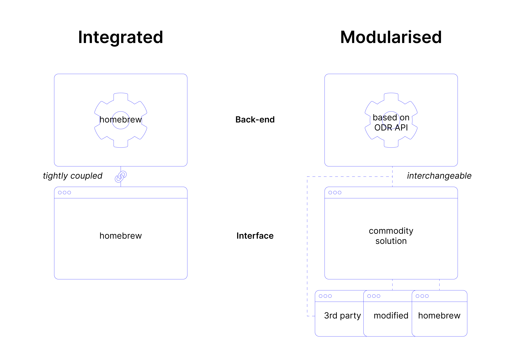

# Modularisation

If an API is standardised and accessible for third parties, the front-end and back-end of any data rights experience is no longer tightly coupled. This provides organisations the opportunity of using available, commodified solutions to act as a user interface to exercise of their data rights. 

### A compliant back-end

Given that the back-end is built on well-known standards, an Open Data Rights API provides crucial assurances to a user-interfacing application: we can identify you, we can identify what data we process, which of that processing applies to you, and what that data looks like. These standardised assurances make building on top of this API in an efficient way much easier.

### A modular front-end

The user-facing aspects of a data rights experience have the strongest cards to delight or depress a citizen. Inventing this wheel again and again not only leads to fragmentation, but frustration on part of the end-user. With assurances about what an API provides, competition between various solutions that consume the API is a lot more levelled.

Moreover this competition means reduced compliance costs for organisations. While they may offer a front-end for exercising data rights, these front-ends are interchangeable and commodified. Organisations no longer need to lock in to a particular compliance vendor, if the product is missing their needs. If the front-end is based on open-source tools, the organisation can choose fork and adjust it to its needs.

Finally, organisations may even make the case that if third party software is available to connect to the API, they should be exempt from offering anything but a data request API. This reduces engineering, design and management effort and thus costs.

